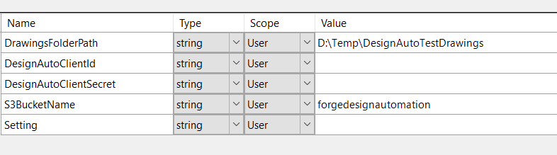

#Design Automation API - WinForm sample
===========================
(Formely AutoCAD I/O)

##Description
A C# WinForm application for performing workflow tasks of Design Automation (called AutoCAD IO in the past) on create custom activities, create AppPackage, submit workitem requests and view downloaded results.

##Dependencies
* As this sample includes a reference to  [design.automation-.net-library](https://github.com/Developer-Autodesk/design.automation-.net-library), please build that sample firstly.  
* Visual Studio 2012. 2013 or 2015 should be also fine, but has not yet been tested.
* Get [credentials of AWS](http://docs.aws.amazon.com/general/latest/gr/aws-security-credentials.html) and create one S3 bucket
* Get your credentials of Design Automation at http://developer.autodesk.com* 

##Setup/Usage Instructions
* Build the library project [design.automation-.net-library](https://github.com/Developer-Autodesk/design.automation-.net-library).
* After you have built the library project, open the *AutoCADIODemo* sample project in Visual Studio 2012
* Restore the packages of the project by [NuGet](https://www.nuget.org/). The simplest way is to Projects tab >> Enable NuGet Package Restore. Then right click the project>>"Manage NuGet Packages for Solution" >> "Restore" (top right of dialog)
* Add other missing references and the library of[design.automation-.net-library](https://github.com/Developer-Autodesk/design.automation-.net-library)
* In the project settings, provide the following details:
 * Path to a local folder in your system that contains AutoCAD drawings.
 * Design Automation Client Id
 * Design Automation Client Secret
 * Bucket name in your AWS S3 Storage

* Open “App.Config” file and fill in AWS credentials. This will allow the sample project to access S3 storage in your AWS profile.

* Build the sample project

* Run AutoCADIODemo.exe. the main window to appear

The path to the sample drawings that was provided in the project settings can also be provided by accessing 
“Settings” button as shown in the below screenshot.

 
Demo 1: Using Shared Design Automation Activity
-----------------------------------------------------------------------------------------------------------------------------
 * Design Automation provides a Shared activity which is named “PlotToPDF”. This activity is available by default. Choose this activity from the list of activities as shown in the below screenshot.Select any drawing from the list of drawings that appear at the left. 

  

  The chosen drawing will be uploaded to the S3 storage and a WorkItem will be created based on the selected activity.
The WorkItem will be submitted to AutoCAD IO for processing and the result will get displayed in the right pane.
 
 
 
Demo 2: Creating and using a custom AutoCAD IO Activity 
-----------------------------------------------------------------------------------------------------------------------------
   To create a custom activity, click on the Activities button as shown in below screenshot and provide the details.
 

 
Important Note : The script should be implemented such that the result file is named as “result.*”. 
The result file name can be any name of your choice, AutoCAD IO does not have a restriction on that. 
But just to make the sample code generic and have it identify the result file automatically from the script, 
the sample project looks for anything that sounds like result.pdf, Result.dwf, RESULT.DWG etc. So for custom activities 
to work, please ensure that the script saves the result with an appropriate file name as result.dwg, result.pdf, result.dwf etc.
After the custom activity is created, close the Activities dialog.
The custom activity should now appear in the list of Activities alongside the shared activity as shown in the below screenshot. 

 
Select the custom activity and choose any drawing from the list of drawings just as we did for using a Shared activity.
The result of the custom activity will be displayed in the right pane if it is a pdf. For any other outputs such as dwg, dwf, 
the result file is downloaded to a local path and the path is displayed in the right pane.

Demo 3: Creating and using a custom AutoCAD IO Activity that is linked to an App Package 
-----------------------------------------------------------------------------------------------------------------------------

Create a custom crx or .Net plugin (that does not reference acmgd.dll)
Package it in AutoCAD Bundle format
Click on “App Packages” button and provide the details as shown in below screenshot
 

 
To create a custom activity that links with the custom app package, click on the Activities button as 
shown in below screenshot and provide the details.
 

After the custom activity is created, close the Activities dialog.
The custom activity should now appear in the list of Activities alongside the shared activity as shown in the below screenshot. 
 

 
Select the custom activity and choose any drawing from the list of drawings just as we did for using a Shared activity.
The result of the custom activity will be downloaded to a local path and the path is displayed as shown in the below screenshot. 
 

 
Verify that the custom command has done its task by opening the downloaded result.

another material of demo3 is: https://github.com/Developer-Autodesk/design.automation-.net-custom.activity.sample
